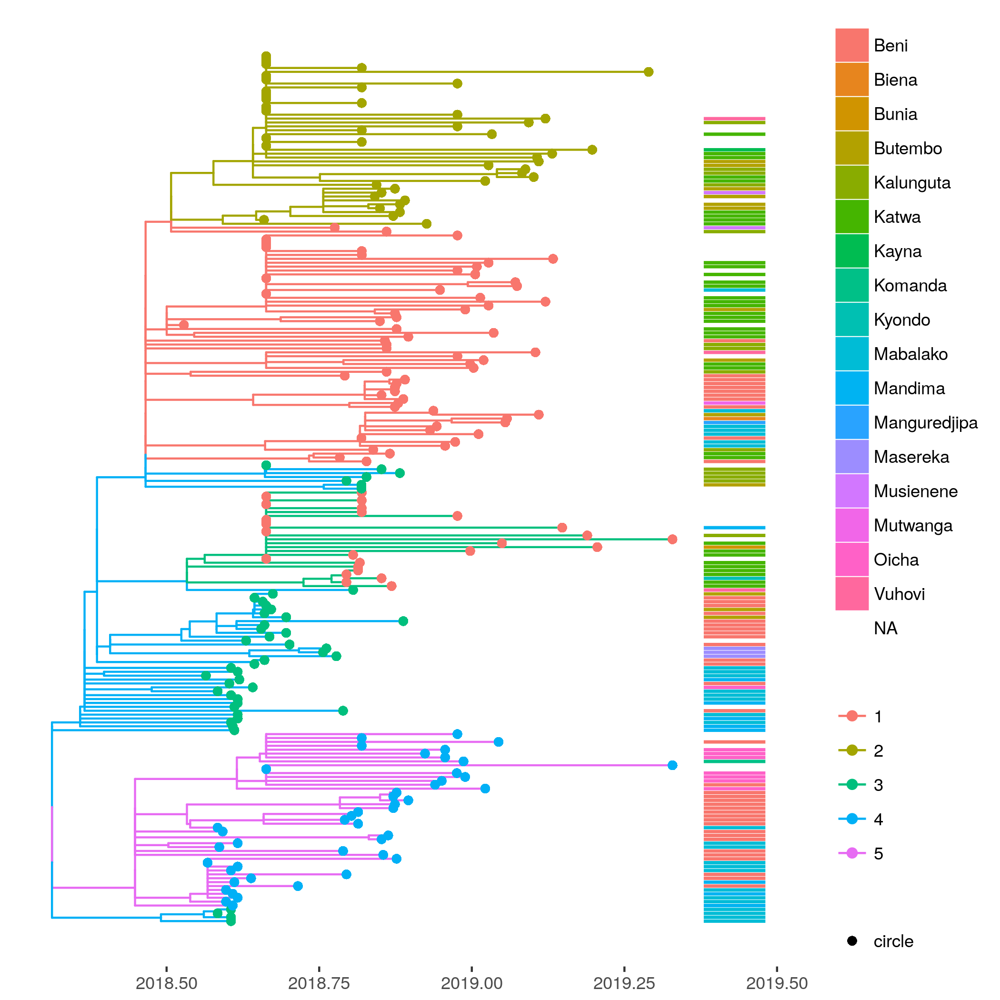
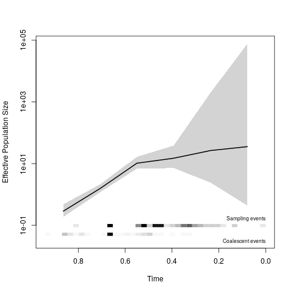
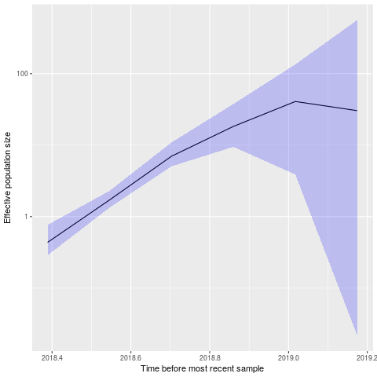
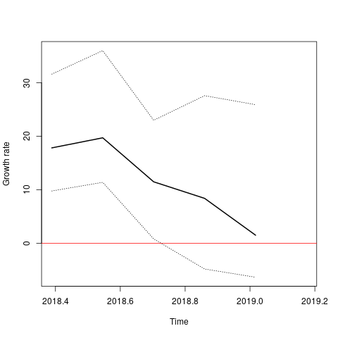

# Ebola DRC 2018-2019: Fast phylodynamics

The data comprise 223 whole genome sequences obtained from here: 

 * (https://drive.google.com/open?id=1lWtefGXrl96lk2qZOZhL4S2BLDLoIKS4)[https://drive.google.com/open?id=1lWtefGXrl96lk2qZOZhL4S2BLDLoIKS4] 
 
 The sequences appear aligned but with some indels which I stripped manually 
 
 Meta-data including time of sampling for some of these sequences is found here: 
 
 * 

## Phylogenetic analysis

Substitution model: Similar to previous studies I use HKY with Gamma(4) rate heterogeneity. Rates differ by codon position. I do not treat the noncoding  region of the genome differently. 

Defines the partition(partition.nexus): 
```
#nexus
begin sets;
    charset part1 = 1-18972\3;
    charset part2 = 2-18972\3;
    charset part3 = 3-18972\3;
end;
```

Estimates a tree by maximum likelihood: 
```
iqtree -nt 4 -m HKY+F+G4 -spp partition.nexus -s Virological_2019-05-02_1.fasta
```
This takes about 8 minutes on 4 cpu's. 


## Molecular clock analysis 

I use `treedater` R package to root and date the tree 

```
library( treedater)
library( ape )

# load metadata 
md <- read.table( 'metadata.tsv', sep = '\t', header = TRUE )
rownames(md) <- md$strain 

# load the ML tree 
tre <- read.tree( 'Virological_2019-05-02_1_iqtree.nwk' )
tre <- unroot( tre ) # will estimate root position 

# load sample times 
md$Date <- as.Date( md$date )
# Note that many samples lack meta data and we will have to estimate the sample time 
sts <- as.numeric( md$Date[ match( tre$tip.label, md$strain ) ] - as.Date( '2018-01-01' ) )
names(sts) <- tre$tip.label
sts <- 2018 + sts / 365 # switch to years 
# provide bounds for the sample times that will be estimated 
st_to_estimate <- names(sts)[which(is.na(sts))]
n  <- length( st_to_estimate)
est = data.frame( row.names = st_to_estimate
 , lower = rep(2018, n)
 , upper = rep( 2018+ as.numeric(  as.Date('2019-05-02') - as.Date( '2018-01-01'))/365 , n ))

# run treedater with strict clock 
st0 <- Sys.time() 
dtr0 <- dater( tre, sts, s = 18e3 , estimateSampleTimes = est , quiet = FALSE, ncpu = 6, strict=TRUE, searchRoot=10)
st1 <- Sys.time() 
```

This takes 12 seconds

The estimated molecular clock rate of evolution and estimated origin dates are 
```
> dtr0
 Time of common ancestor 
2018.31493774064 

 Time to common ancestor (before most recent sample) 
1.01649608628031 

 Mean substitution rate 
0.000357243356201094 

```


The TMRCA corresponds to a calendar date: 
```
library(lubridate)
lubridate::date_decimal( dtr0$time_of)
```
_2018-04-25 22:51:16 UTC_


This date coincides well with the dates of first reports of Ebola cases:
[https://www.who.int/csr/don/10-may-2018-ebola-drc/en/](https://www.who.int/csr/don/10-may-2018-ebola-drc/en/)
It is also a bit earlier than what is on [https://nextstrain.org/community/inrb-drc/ebola-nord-kivu](https://nextstrain.org/community/inrb-drc/ebola-nord-kivu)


This estimates confidence intervals using parametric bootstrap: 
```
(pb0 <- parboot( dtr0, overrideTempConstraint=FALSE , ncpu = 8 ))
							pseudo ML       2.5 % 		97.5 %
Time of common ancestor 	2018.315 		2017.864	2018.416
```
This takes less than one minute.


## Population structure

These functions partition the phylogeny into a set of clades with similar coalescent histories 

```
library( treestructure )
ts0 <- trestruct(dtr0)
```

This finds

```
Call: 
trestruct(tre = dtr0)

Number of clusters: 5 
Number of partitions: 4 
Significance level: 0.01 
```

We can visualize this and also show location of sampling 

```
library( ggtree  )
p <- plot( ts0, mrsd = date_decimal(max(dtr0$sts) ) ) + theme_tree2() 
missing_loc <- setdiff( dtr0$tip.label, md$strain )
md[ missing_loc, ] <- NA
# remove factors
md$health_zone <- as.character( md$health_zone )
md$health_zone [ md$health_zone == '?' ] <- NA 

p2 <- gheatmap(p, md['health_zone'], offset=.0, width=0.1, colnames=FALSE)
ggsave( p2, file = 'ebov20190502_treedater_treestructure.png' )
```



Internal colours show estimated partitions. Bars on right show location of sampling. 

We can check association of partitions and locations: 

```
tsdf <- as.data.frame( ts0 )
tsdf$hz <- md$health_zone[ match( tsdf$taxon, md$strain ) ]

with ( tsdf, table( hz, partition ))
```

```
              partition
hz              1  2  3  4
  Beni         11  0 14 20
  Biena         1  0  0  0
  Bunia         1  0  0  0
  Butembo       3  6  4  0
  Kalunguta     6  4  4  0
  Katwa        27  9  0  0
  Kayna         0  1  0  0
  Komanda       0  0  0  1
  Kyondo        1  0  0  0
  Mabalako      7  0 12  9
  Mandima       1  0  5  3
  Manguredjipa  1  0  0  0
  Masereka      0  0  3  0
  Musienene     1  1  0  0
  Mutwanga      1  0  0  0
  Oicha         0  0  1  7
  Vuhovi        1  1  1  0
```


And the distribution is, unsurprisingly, far from random: 

```
chisq.test( as.matrix( with ( tsdf, table( hz, partition )) ) )  
```

```
	Pearson's Chi-squared test

data:  as.matrix(with(tsdf, table(hz, partition)))
X-squared = 137.65, df = 48, p-value = 1.37e-10
```


## Exploratory phylodynamics

Here I use two nonparametric methods for estimating Ne(t) applied to one of the clades identified above. 

* phylodyn: Approximate Bayesian method based on INLA
* skygrowth: Approximate Bayesian method estimating growth rate of Ne(t)

I show results for partition 1 which comprises 86 samples and seems to have large representation in Katwa. 

Extract the clade

```
cl1 <- ape::keep.tip( dtr0, ts0$partitionSets[['1']] )
class( cl1 ) <- 'phylo'
```

Now run phylodyn. This clade has a MRCA about 1 year in the past. 
Note regarding the timestep used in these models: I choose  a large timestep that corresponds to about 2 months because the sample size is small and cases are sporadic. If a smaller timestep is used, the dynamics appear much noiser and harder to interpret, which is also a consequence of using a single tree. 

```
library( phylodyn )
bnpr <- BNPR( cl1 , lengthout = 6)
plot_BNPR( bnpr )
```



Now run skygrowth 

```
library ( skygrowth )
sg <- skygrowth.mcmc( cl1 , res = 6 )
# max sample time
mst <- max( dtr0$sts[ cl1$tip.label ] )
sg$time <- sg$time + mst 
plot( sg, ggplot=T, logy=T )
growth.plot( sg , ggplot=FALSE )
abline( h=0, col='red')
```





The tentative conclusion is that this sub-epidemic has stabilized and may now have starting shrinking as of early May.

Both of these methods run in under 1 minute. 

It would be easy to repeat this for other partitions. 

## Next steps? 

* Model-based phylodynamics in BEAST? 
* Correlates of growth? Growth related to interventions? 
* Non-parametric bootstrap in treedater would be more robust 
* Find missing sample times? 
