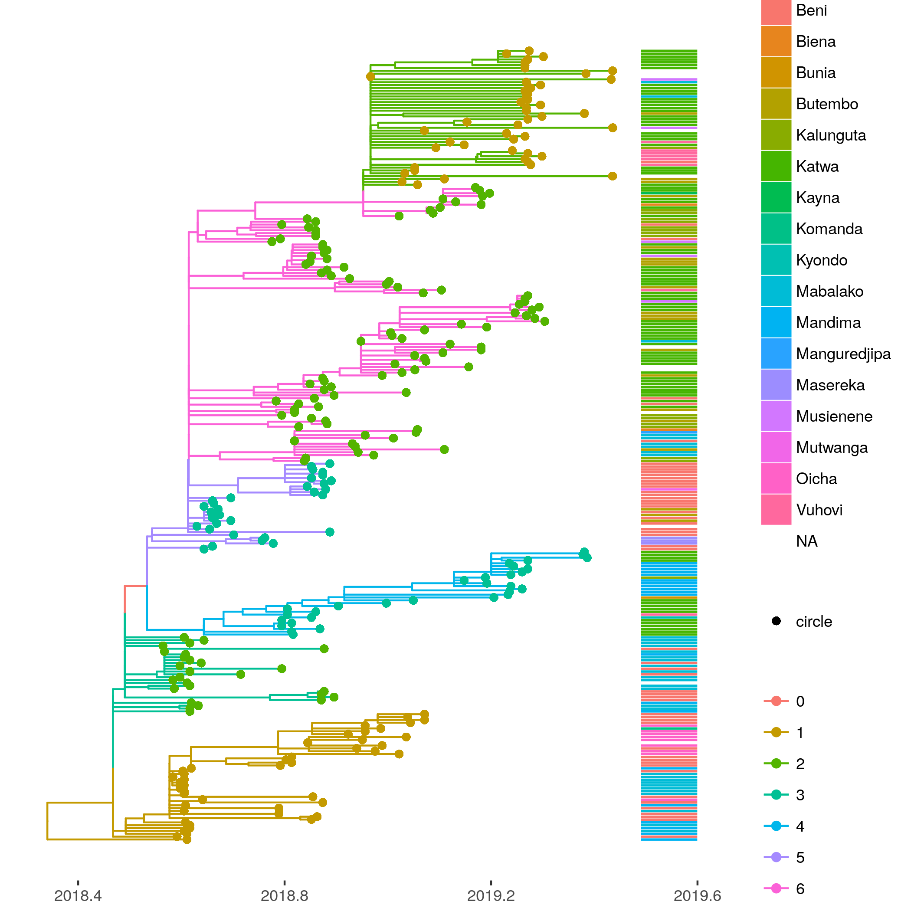

# Ebola DRC 2018-2019: Fast phylodynamics

**updated July 19, 019**

This demonstrates a 'fast' analysis using a combination of maximum likelihood, pseudo-maximum likelihood and approximate Bayesian methods implemented in R.

Data were originally presented by Catherine Pratt et al. here: 
https://nextstrain.org/community/inrb-drc/ebola-nord-kivu


## Alignment


Profile align sequences against previous alignment using many strains from Gire 2014:
```
mafft --keeplength --add sequences_2019-7-16.fasta --reorder gire2014-ebov.mafft.fasta  > algn0.fasta
```

Now remove the external sequences from the alignment: 

```r
library( ape ) 
algn <- read.dna( 'algn0.fasta', format = 'fasta')
algn1 <- algn[ !grepl(pattern='EBOV_.*',  rownames(algn)) , ]
write.dna( algn1, file = 'algn1.fasta' , format = 'fasta')
```


## Phylogenetic analysis

Substitution model: Similar to previous studies I use HKY with Gamma(4) rate heterogeneity. Rates differ by codon position. I do not treat the noncoding  region of the genome differently. 

Estimates a tree by maximum likelihood: 
```
iqtree -nt AUTO -m HKY+F+G4 -spp ml.nexus -s algn1.fasta 
```

This computes standard non-parametric bootstrap trees: 
```
iqtree -nt AUTO -m HKY+F+G4 -spp ml.nexus -s algn1.fasta -bo 100 -wbtl
```

Note the `wbtl` option which writes bootstrap trees including branch lengths. 

There are about 120 informative sites out of 18000, which is not a huge amount to go on. 


## Molecular clock analysis 

I use `treedater` R package to root and date the tree 


```r
library( treedater)
library( ape )
```

Load metadata: 

```r
md <- read.table( 'metadata_2019-07-16.tsv', sep = '\t', header = TRUE )
rownames(md) <- md$strain 
head( md )
```

```
##            strain virus accession date_symptom_onset       date
## 18FHV089 18FHV089 ebola  MK007329         2018-07-25 2018-07-27
## 18FHV090 18FHV090 ebola  MK007330                    2018-07-28
## BEN017     BEN017 ebola  MK163644         2018-07-27 2018-08-03
## BEN018     BEN018 ebola  MK163645                    2018-08-03
## BEN020     BEN020 ebola  MK163646                    2018-08-03
## BEN031     BEN031 ebola  MK163647                    2018-08-04
##          health_zone  province                          country
## 18FHV089    Mabalako Nord-Kivu Democratic_Republic_of_the_Congo
## 18FHV090    Mabalako Nord-Kivu Democratic_Republic_of_the_Congo
## BEN017      Mabalako Nord-Kivu Democratic_Republic_of_the_Congo
## BEN018      Mabalako Nord-Kivu Democratic_Republic_of_the_Congo
## BEN020      Mabalako Nord-Kivu Democratic_Republic_of_the_Congo
## BEN031      Mabalako Nord-Kivu Democratic_Republic_of_the_Congo
##               authors
## 18FHV089 Mbala et al.
## 18FHV090 Mbala et al.
## BEN017   Mbala et al.
## BEN018   Mbala et al.
## BEN020   Mbala et al.
## BEN031   Mbala et al.
```


Load the ML tree 

```r
tre <- read.tree( 'ml.nexus.treefile' )
tre <- unroot( tre ) # will estimate root position 
```

Load sample times. Note that many samples lack meta data and we will have to estimate the sample time. Make a data frame to summarize these. 

```r
library( lubridate ) # for date conversions 
md$Date <- as.Date( md$date )

sts <- decimal_date( md$Date ) # sample times vector 
names(sts) <- tre$tip.label
# provide bounds for the sample times that will be estimated 
st_to_estimate <- names(sts)[which(is.na(sts))]
n  <- length( st_to_estimate)
est = data.frame( row.names = st_to_estimate
 , lower = rep(2018.5, n)
 , upper = rep(max( na.omit( sts ) ), n ))
```

We can put bounds on the molecular clock rate based on previous studies. 

```r
mrl <- c( .0005, .002 ) # the estimated clock rate should fall between these values 
```

Here we run treedater with a strict molecular clock. I have found that the relaxed clock gives similar dates but has unusually high rate variation indicating poor fit. Strict clock estimates tend to be a bit more stable (fewer bad outliers), so a safer choice in this case.

```r
# run treedater with strict clock 
s.dtr0 <- dater( tre, sts, s = 18e3 , estimateSampleTimes = est , quiet = FALSE, ncpu = 6, strict=TRUE, meanRateLimits = mrl)
```


We can use `treedater` to find outliers and remove these from the analysis: 

```r
# look for outliers and remove these: 
s.ol0 <- outlierTips( s.dtr0 )
```

```
##           taxon            q            p     loglik       rates
## BEN234   BEN234 2.636702e-06 9.450546e-09 -12.280394 0.000542902
## KAT5563 KAT5563 7.208789e-04 5.167591e-06 -10.690683 0.000542902
## KAT2677 KAT2677 2.391908e-03 2.571944e-05  -7.027787 0.000542902
## MAN1891 MAN1891 3.569232e-03 5.117179e-05  -8.756785 0.000542902
## BTB8497 BTB8497 1.253373e-02 2.246189e-04  -7.095221 0.000542902
## MAN2015 MAN2015 1.757221e-02 3.778971e-04  -5.268355 0.000542902
## BEN5944 BEN5944 2.992584e-02 8.137772e-04  -6.081991 0.000542902
## MAN039   MAN039 2.992584e-02 8.580886e-04  -4.739188 0.000542902
```

```r
toremove <- as.character( s.ol0$taxon )[ s.ol0$q < .05]
s.tre1 <- drop.tip( tre, toremove )
```

Re-run without outliers

```r
s.dtr1 <- dater( unroot(s.tre1), sts, s = 18e3 , estimateSampleTimes=est, quiet = FALSE, ncpu = 6, strict=TRUE, meanRateLimits = mrl )
```

```
## NOTE: initial guess of sample times for following lineages was not provided:
## BEN163 BEN2064 BEN018 BEN379 BEN114 18FHV089 MAN035 BEN148
```

```r
s.dtr1
```

```
## 
## Phylogenetic tree with 271 tips and 270 internal nodes.
## 
## Tip labels:
## 	BTB6375, KAT2689, KAT2291, KAT5915, KAT2012, KAT2573, ...
## 
## Rooted; includes branch lengths.
## 
##  Time of common ancestor 
## 2018.38018787688 
## 
##  Time to common ancestor (before most recent sample) 
## 1.05816828750358 
## 
##  Mean substitution rate 
## 0.000718847050625473 
## 
##  Strict or relaxed clock 
## strict 
## 
##  Coefficient of variation of rates 
## 0
```

Here is the relaxed clock version which I won't use subseuqently: 

```r
dtr0 <- dater( tre, sts, s = 18e3 , estimateSampleTimes = est , quiet = FALSE, ncpu = 6, strict=FALSE, meanRateLimits = mrl )
ol0 <- outlierTips( dtr0 )
```


```
##           taxon           q            p    loglik       rates
## BEN234   BEN234 0.002058063 1.475314e-05 -8.275665 0.011373242
## MAN039   MAN039 0.002058063 1.475314e-05 -8.275665 0.007643149
## KAT2677 KAT2677 0.013942113 1.499152e-04 -6.758768 0.007232593
```

```r
tre1 <- drop.tip( tre, as.character( ol0$taxon )[ ol0$q < .05] )
dtr1 <- dater( unroot(tre1), sts, s = 18e3 , estimateSampleTimes = est , quiet = FALSE, ncpu = 6, strict=FALSE, meanRateLimits = mrl )
dtr1
```

```
 Time of common ancestor 
2017.99881233053 

 Time to common ancestor (before most recent sample) 
1.43954383385449 

 Mean substitution rate 
0.000188066133171088 

 Strict or relaxed clock 
relaxed 

 Coefficient of variation of rates 
1.20575845190787 
```


### Quick plot 


```r
plot( s.dtr1, show.tip=F ) ; axisPhylo( root.time=s.dtr1$timeOfMRCA , backward=FALSE ) 
```


### Parametric bootstrap 

Estimate CIs for rates and date using parametric bootstrap procedure


```r
pb1 <- parboot( s.dtr1, ncpu = 8, overrideTempConstraint = FALSE )
```

```r
pb1
```

```
##                            pseudo ML        2.5 %       97.5 %
## Time of common ancestor 2.018380e+03 2.018195e+03 2.018475e+03
## Mean substitution rate  7.188471e-04 5.798613e-04 8.911461e-04
## 
##  For more detailed output, $trees provides a list of each fit to each simulation
```

The estimated TMRCA of the tree and CI in nicer format : 

```r
date_decimal( c(s.dtr1$timeOf,  pb1$timeOf ) )
```

```
##                                                2.5%                     97.5% 
## "2018-05-19 18:26:44 UTC" "2018-03-13 03:39:53 UTC"  "2018-06-23 05:14:40 UTC"

```


## Population structure


Here we use a new approach to detect population structure in the tree. 

```r
library( treestructure )
# change the class to ape::phylo 
phylo.s.dtr1 <- s.dtr1
class( phylo.s.dtr1 ) <- 'phylo' 
# note this is a ladder-like tree, so will require some time-overlap between partitions
( ts0 <- trestruct(phylo.s.dtr1, minOverlap = 20, nsim = 1e4 ) )
```

```
## Finding splits under nodes: 272 
## Finding splits under nodes: 272 292 
## Finding splits under nodes: 282 292 
## Finding splits under nodes: 282 292 385 449 
## Finding splits under nodes: 282 494
```

```
## Call: 
## trestruct(tre = phylo.s.dtr1, minOverlap = 20, nsim = 10000)
## 
## Number of clusters: 6 
## Number of partitions: 2 
## Significance level: 0.01 
```

## plots 


```r
library( ggtree  )
p <- plot( ts0, mrsd = date_decimal(max(s.dtr1$sts) ) ) + theme_tree2() 
missing_loc <- setdiff( s.dtr1$tip.label, md$strain )
md[ missing_loc, ] <- NA
# remove factors
md$health_zone <- as.character( md$health_zone )
md$health_zone [ md$health_zone == '?' ] <- NA 
p2 <- gheatmap(p, md['health_zone'], offset=.0, width=0.1, colnames=FALSE)
ggsave( p2, file = 'ebov16july2019_treedater_treestructure.png' )
```

 


