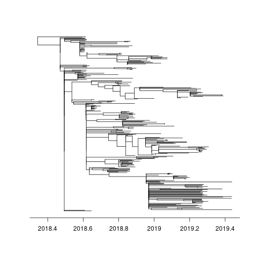
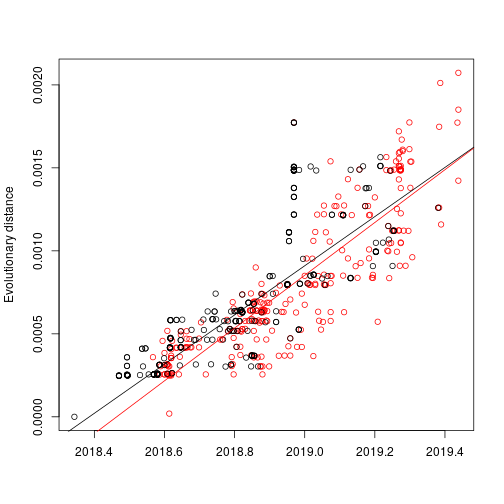

# Ebola DRC 2018-2019: Fast phylodynamics

**updated July 19, 019**

This demonstrates a 'fast' analysis using a combination of maximum likelihood, pseudo-maximum likelihood and approximate Bayesian methods implemented in R.

Data were originally presented by Catherine Pratt et al. here: 
https://nextstrain.org/community/inrb-drc/ebola-nord-kivu


## Alignment


Profile align sequences against previous alignment using many strains from Gire 2014:
```
mafft --keeplength --add sequences_2019-7-16.fasta --reorder gire2014-ebov.mafft.fasta  > algn0.fasta
```

Now remove the external sequences from the alignment: 

```r
library( ape ) 
algn <- read.dna( 'algn0.fasta', format = 'fasta')
algn1 <- algn[ !grepl(pattern='EBOV_.*',  rownames(algn)) , ]
write.dna( algn1, file = 'algn1.fasta' , format = 'fasta')
```


## Phylogenetic analysis

Substitution model: Similar to previous studies I use HKY with Gamma(4) rate heterogeneity. Rates differ by codon position. I do not treat the noncoding  region of the genome differently. 

Estimates a tree by maximum likelihood: 
```
iqtree -nt AUTO -m HKY+F+G4 -spp ml.nexus -s algn1.fasta 
```

This computes standard non-parametric bootstrap trees: 
```
iqtree -nt AUTO -m HKY+F+G4 -spp ml.nexus -s algn1.fasta -bo 100 -wbtl
```

Note the `wbtl` option which writes bootstrap trees including branch lengths. 

There are about 120 informative sites out of 18000, which is not a huge amount to go on. 


## Molecular clock analysis 

I use `treedater` R package to root and date the tree 


```r
library( treedater)
library( ape )
```

Load metadata: 

```r
md <- read.table( 'metadata_2019-07-16.tsv', sep = '\t', header = TRUE )
rownames(md) <- md$strain 
head( md )
```

```
##            strain virus accession date_symptom_onset       date
## 18FHV089 18FHV089 ebola  MK007329         2018-07-25 2018-07-27
## 18FHV090 18FHV090 ebola  MK007330                    2018-07-28
## BEN017     BEN017 ebola  MK163644         2018-07-27 2018-08-03
## BEN018     BEN018 ebola  MK163645                    2018-08-03
## BEN020     BEN020 ebola  MK163646                    2018-08-03
## BEN031     BEN031 ebola  MK163647                    2018-08-04
##          health_zone  province                          country
## 18FHV089    Mabalako Nord-Kivu Democratic_Republic_of_the_Congo
## 18FHV090    Mabalako Nord-Kivu Democratic_Republic_of_the_Congo
## BEN017      Mabalako Nord-Kivu Democratic_Republic_of_the_Congo
## BEN018      Mabalako Nord-Kivu Democratic_Republic_of_the_Congo
## BEN020      Mabalako Nord-Kivu Democratic_Republic_of_the_Congo
## BEN031      Mabalako Nord-Kivu Democratic_Republic_of_the_Congo
##               authors
## 18FHV089 Mbala et al.
## 18FHV090 Mbala et al.
## BEN017   Mbala et al.
## BEN018   Mbala et al.
## BEN020   Mbala et al.
## BEN031   Mbala et al.
```


Load the ML tree 

```r
tre <- read.tree( 'ml.nexus.treefile' )
tre <- unroot( tre ) # will estimate root position 
```

Load sample times. Note that many samples lack meta data and we will have to estimate the sample time. Make a data frame to summarize these. 

```r
library( lubridate ) # for date conversions 
md$Date <- as.Date( md$date )
md$sts <- decimal_date( md$Date ) # numeric sample time 
sts <- setNames( md[ tre$tip.label, ]$sts, tre$tip.label ) # sample time vector
# provide bounds for the sample times that will be estimated 
st_to_estimate <- names(sts)[which(is.na(sts))]
n  <- length( st_to_estimate )
est = data.frame( row.names = st_to_estimate
 , lower = rep(2018.5, n)
 , upper = rep(max( na.omit( sts ) ), n ))
```

We can put bounds on the molecular clock rate based on previous studies. 

```r
#mrl <- c( .0005, .002 ) # the estimated clock rate should fall between these values 
```

Here we run treedater with a strict molecular clock. I have found that the relaxed clock gives similar dates but has unusually high rate variation indicating poor fit. Strict clock estimates tend to be a bit more stable (fewer bad outliers), so a safer choice in this case.

```r
# run treedater with strict clock 
s.dtr0 <- dater( tre, sts, s = 18e3 , estimateSampleTimes = est , quiet = FALSE, ncpu = 6, strict=TRUE, meanRateLimits = mrl)
```

```
## NOTE: initial guess of sample times for following lineages was not provided:
## KAT5915 KAT5497 KAT5596 KAT5483 BTB18344 BTB4376 BEN3224 BEN3232
## Will proceed with midpoint of provided range as initial guess of these sample times.
## Note: Minimum temporal branch length  (*minblen*) set to 0.000312269848284008. Increase *minblen* in the event of convergence failures. 
## Tree is not rooted. Searching for best root position. Increase searchRoot to try harder.
```


We can use `treedater` to find outliers and remove these from the analysis: 

```r
# look for outliers and remove these: 
s.ol0 <- outlierTips( s.dtr0 )
```

```
##         taxon           q            p    loglik        rates
## BEN018 BEN018 0.002536767 9.092354e-06 -5.806051 0.0005369978
##        branch.length
## BEN018             0
```

```r
toremove <- as.character( s.ol0$taxon )[ s.ol0$q < .05]
s.tre1 <- drop.tip( tre, toremove )
```

Re-run without outliers

```r
s.dtr1 <- dater( unroot(s.tre1), sts, s = 18e3 , estimateSampleTimes=est, quiet = FALSE, ncpu = 6, strict=TRUE, meanRateLimits = mrl )
```

```
## NOTE: initial guess of sample times for following lineages was not provided:
## KAT5915 KAT5497 KAT5596 KAT5483 BTB18344 BTB4376 BEN3224 BEN3232
## Will proceed with midpoint of provided range as initial guess of these sample times.
## Note: Minimum temporal branch length  (*minblen*) set to 0.000313393121119562. Increase *minblen* in the event of convergence failures. 
## Tree is not rooted. Searching for best root position. Increase searchRoot to try harder.
```

```r
s.dtr1
```

```
## 
## Phylogenetic tree with 278 tips and 277 internal nodes.
## 
## Tip labels:
## 	BEN234, KAT5563, BTB6375, KAT2689, KAT2291, KAT5915, ...
## 
## Rooted; includes branch lengths.
## 
##  Time of common ancestor 
## 2018.34309139759 
## 
##  Time to common ancestor (before most recent sample) 
## 1.09526476679162 
## 
##  Mean substitution rate 
## 0.00053618041769699 
## 
##  Strict or relaxed clock 
## strict 
## 
##  Coefficient of variation of rates 
## 0
```

Here is the relaxed clock version which I won't use subseuqently: 

```r
dtr0 <- dater( tre, sts, s = 18e3 , estimateSampleTimes = est , quiet = FALSE, ncpu = 6, strict=FALSE, meanRateLimits = mrl )
```

```
## NOTE: initial guess of sample times for following lineages was not provided:
## KAT5915 KAT5497 KAT5596 KAT5483 BTB18344 BTB4376 BEN3224 BEN3232
## Will proceed with midpoint of provided range as initial guess of these sample times.
## Note: Minimum temporal branch length  (*minblen*) set to 0.000312269848284008. Increase *minblen* in the event of convergence failures. 
## Tree is not rooted. Searching for best root position. Increase searchRoot to try harder.
```

```r
ol0 <- outlierTips( dtr0 )
```

```
## [1] taxon         q             p             loglik        rates        
## [6] branch.length
## <0 rows> (or 0-length row.names)
```

```r
tre1 <- drop.tip( tre, as.character( ol0$taxon )[ ol0$q < .05] )
dtr1 <- dater( unroot(tre1), sts, s = 18e3 , estimateSampleTimes = est , quiet = FALSE, ncpu = 6, strict=FALSE, meanRateLimits = mrl )
```

```
## NOTE: initial guess of sample times for following lineages was not provided:
## KAT5915 KAT5497 KAT5596 KAT5483 BTB18344 BTB4376 BEN3224 BEN3232
## Will proceed with midpoint of provided range as initial guess of these sample times.
## Note: Minimum temporal branch length  (*minblen*) set to 0.000312269848284008. Increase *minblen* in the event of convergence failures. 
## Tree is not rooted. Searching for best root position. Increase searchRoot to try harder.
```

```r
dtr1
```

```
## 
## Phylogenetic tree with 279 tips and 278 internal nodes.
## 
## Tip labels:
## 	BEN234, KAT5563, BTB6375, KAT2689, KAT2291, KAT5915, ...
## 
## Rooted; includes branch lengths.
## 
##  Time of common ancestor 
## 2018.24312712901 
## 
##  Time to common ancestor (before most recent sample) 
## 1.19522903537677 
## 
##  Mean substitution rate 
## 0.000180664144823635 
## 
##  Strict or relaxed clock 
## relaxed 
## 
##  Coefficient of variation of rates 
## 0.890730292516331
```

### Quick plot 


```r
plot( s.dtr1, show.tip=F ) ; axisPhylo( root.time=s.dtr1$timeOfMRCA , backward=FALSE ) 
```



Root-to-tip plot. Black points represent internal node dates identified with `treedater`

```r
rootToTipRegressionPlot( s.dtr1 )
```



```
## Root-to-tip mean rate: 0.00159015756075696 
## Root-to-tip p value: 3.52810669810118e-85 
## Root-to-tip R squared (variance explained): 0.750462962182243 
## Returning fitted linear model.
```

### Parametric bootstrap 

Estimate CIs for rates and date using parametric bootstrap procedure


```r
pb1 <- parboot( s.dtr1, ncpu = 8, overrideTempConstraint = FALSE )
```

```r
pb1
```

```
##                            pseudo ML        2.5 %       97.5 %
## Time of common ancestor 2.018343e+03 2.017984e+03 2.018490e+03
## Mean substitution rate  5.361804e-04 3.800671e-04 7.564175e-04
## 
##  For more detailed output, $trees provides a list of each fit to each simulation
```

The estimated TMRCA of the tree and CI in nicer format : 

```r
date_decimal( c(s.dtr1$timeOf,  pb1$timeOf ) )
```

```
##                                                2.5% 
## "2018-05-06 05:28:50 UTC" "2017-12-25 23:49:20 UTC" 
##                     97.5% 
## "2018-06-28 19:59:59 UTC"
```


## Population structure


Here we use a new approach to detect population structure in the tree. 

```r
library( treestructure )
# change the class to ape::phylo 
phylo.s.dtr1 <- s.dtr1
class( phylo.s.dtr1 ) <- 'phylo' 
# note this is a ladder-like tree, so will require some time-overlap between partitions
( ts0 <- trestruct(phylo.s.dtr1, minOverlap = 10, nsim = 1e4, level = .05, ncpu = 8 ) )
```

```
## Finding splits under nodes: 279 
## Finding splits under nodes: 279 282 
## Finding splits under nodes: 279 282 306 495 
## Finding splits under nodes: 282 283 
## Finding splits under nodes: 283 294
```

```
## Call: 
## trestruct(tre = phylo.s.dtr1, minOverlap = 10, nsim = 10000, 
##     level = 0.05, ncpu = 8)
## 
## Number of clusters: 6 
## Number of partitions: 3 
## Significance level: 0.05 
## Cluster and partition assignment: 
##      taxon cluster partition
## 1   BEN234       3         2
## 2  KAT5563       2         1
## 3  BTB6375       2         1
## 4  KAT2689       2         1
## 5  KAT2291       2         1
## 6  KAT5915       2         1
## 7  KAT2012       2         1
## 8  KAT2573       2         1
## 9  KAT2188       2         1
## 10 BTB5671       2         1
## ...
## For complete data, use `as.data.frame(...)`
```

## plots 


```r
library( ggtree  )
p <- plot( ts0, mrsd = date_decimal(max(s.dtr1$sts) ) ) + theme_tree2() 
missing_loc <- setdiff( s.dtr1$tip.label, md$strain )
md[ missing_loc, ] <- NA
# remove factors
md$health_zone <- as.character( md$health_zone )
md$health_zone [ md$health_zone == '?' ] <- NA 
p2 <- gheatmap(p, md['health_zone'], offset=.0, width=0.1, colnames=FALSE)
#ggsave( p2, file = 'ebov16july2019_treedater_treestructure.png' )
p2
```


This plot shows 3 'health zone clusters': 

```r
hz1 <- c( 'Beni', 'Mandima', 'Oicha', 'Mabalako', 'Mutwanga', 'Komanda',
'Nyakunde', 'Tchomia', 'Rwampara', 'Bunia', 'Aliwara', 'Mambasa')
hz2 <- c( 'Butembo', 'Katwa', 'Kalunguta', 'Goma')
hz3 <- c( 'Masereka', 'Lubero', 'Musienene', 'Kayna', 'Kyondo', 'Biena','Manguredjipa', 'Alimbongo', 'Vuhovi')
md$hz <- NA 
md$hz[ md$health_zone %in% hz1 ] <- 'HZ1' 
md$hz[ md$health_zone %in% hz2 ] <- 'HZ2' 
md$hz[ md$health_zone %in% hz3 ] <- 'HZ3' 

p3 <- gheatmap(p, md['hz'], offset=.0, width=0.1, colnames=FALSE)
#ggsave( p3, file = 'ebov16july2019_treedater_treestructure_healthzones.png' )
p3
```


